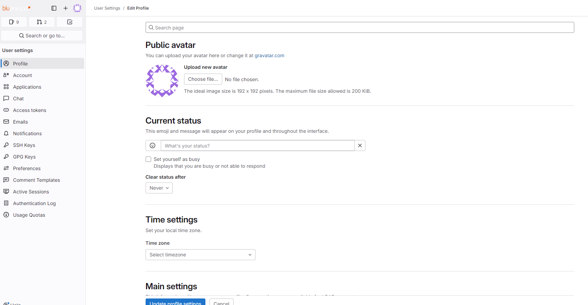
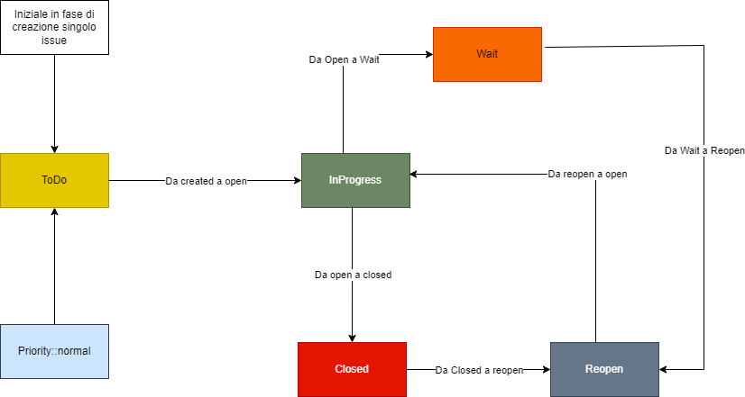

# Issue project

## Linguaggi 

- php 8.3
- laravel 11
- node 20.11.0
- npm 10.2.4
- database sqlite in file presente sotto il path *storage/app/database*

## Login

La login avviene attraverso SSO realm operatore.

## Docker

<pre>docker build -t issue:stable .</pre>

<pre>docker run --name issue -p 8000:80 issue:stable </pre>

- app all'url [localhost](http://localhost:8000)

## Example repository-issue

- [Boards](https://repo.bluarancio.com/antonio.sugamele/base-prj-laravel10-vue3/-/boards)
- [Labels](https://repo.bluarancio.com/antonio.sugamele/base-prj-laravel10-vue3/-/labels)

***
***

## Impostazioni di base

- Creare un o più *Milestones*(sono legati al progetto e sono dei raggruppamenti a livello alto), che rapperesentano quelli che su Jira sono gli Epic (un raggruppamento); questi per ogni progetto.
- Vanno creati i *labels*, che rappresentano un modo di raggruppare in tag i vari issue
- Creare una dashboard per la visualizzazione degli issue, secondo i raggruppamenti sopra

## Modi di creare i labels

1. copiare e ricreare a mano da un progetto base i vari labels e le dashboard
2. Usare le api

Per usare le api si necessità di un *access token*, su gitLab per leggere e scrivere utilizzando le api
L'accessToken si può creare dal proprio profilo basta cliccare su *Edit Profile* e poi sulla relativa voce di Menù a destra (vedi foto sotto).

*Esempio di chiamata api*

Chiamo l'api in get dei labels (https://repo.bluarancio.com/api/v4/projects/:id_project/labels), dove si passa come Bearer Token il vostro access token,
ciclarla e chiamare l'api di insert che è questa:

<pre>
curl --location 'https://repo.bluarancio.com/api/v4/projects/:id/labels' \
--header 'Content-Type: application/json' \
--header 'Authorization: Bearer ***********' \
--data '{
    "name": "Test",
    "description": "Test",
    "color": "#000000",
    "priority":100
}'
</pre>

***

Per evitare ciò ho creato questo progetto che sarà spiegato nei prossimi Passaggi.

## Passaggi
Si entra con l'utenza di operatore personale (questo così in fase di creazione si vede chi ha creato cosa), si registra il proprio access token e si seguono i passaggi sotto. 

1. scegliere il progetto
2. replicare nel progetto i *labels*
3. replicare le *dashboard*

Una volta  entrati, verrà chiesto di salvare il proprio *access token*; se l'operazione è andata a buon fine, il sistema crea i dati base(per labels e board) che dovranno essere replicati sul progetto scelto.

Ci sono le seguenti voci di menù:

1. *Labels*: lista dei labels, nessuna azione possibile
2. *Boards*: lista delle boards, nessuna azione possibile
3. *Failed Jobs*: lista dei jobs falliti
4. *Progetti*: Lista dei progetti

Solo la pagina realtiva al menù del p.to *4*, contiene delle azione.
La pagina si presenta in forma tabellare, dove sono riportati i seguenti campi:
- nome del progetto
- descrizione del progetto
- se sono presenti labels
- se sono presenti boards
- azioni:
  - link del repository
  - info del progetto
  - duplicazione dei labels/boards base

Come si evince dal nome dell'ultimo punto, cliccacndo sul relativo pulsante si aprirà una modale, in cui sarà possibile scegliere cosa replicare (all o boards o labels);

**NOTA**: per replicare le *boards* è necessario che sia state replicate prima le *labels*

Alla scelta di un checkbox e dopocchè si è premuto sul pulsante sotto in bassso a sinistra, il sistema avvia la procedura di copia in modalità jobs, quindi il risultato non sarà visibile ma, eventualmente, solo il loro fallimento.

## Creazione issue

**Singolo/Manuale**

Si và nella sezione dedicata e deve essere creato con i labels:
- *Priority::normal**
- *ToDo*

**Import**

Il file csv deve contenere quanto segue:
- HEADER:
**Title,Description,Labels**

- BODY EXAMPLE
"Test","Test description","Etichetta labels separate da ,"

## Status flow

- Stato iniziale: *ToDo*
- Dallo stato inziale si può passare in *InProgress*
- Dallo stato *inProgress*, si può passare agli stati:
  - *Wait*, se si è in attesa di info o altro
  - *Closed*, se è terminato
- Dallo stato *Closed*, si può passare allo stato *ReOpen*
- Dallo stato *ReOpen* si può passare allo stato *InProgress*

## Altre tipologie di task

Sono previsti dei task con priorità:

- Priority::low
- Priority::normal
- Priority::medium
- Priority::high

Inoltre, esistono i task senza priorità:
- BugFix
- SottoTask
- Epic

**NOTA**: L'issue creato con il labels *Epic*, rappresenta un issue padre di altri issue. In pratica è la stessa cosa del *Milestone*, con la differenza che è un issue.
